# What is Buffer Cache?

The buffer cache in SQL Server is the memory that allows you to query frequently accessed data quickly. When data is written to or read from a SQL Server database, the buffer manager copies it into the buffer cache (aka the buffer pool). When it’s full, older or less frequently used data pages are moved to the hard disk.

# What is in the buffer cache?

Hard disks are slow; memory is fast. This is a fact of nature for anyone that works with computers. Even SSDs are slow when compared to high-performance memory. The way in which software deals with this problem is to write data from slow storage into fast memory. Once loaded, your favorite apps can perform very fast and only need to go back to disk when new data is needed. This fact of life in computing is also an important part of SQL Server architecture.

Whenever data is written to or read from a SQL Server database, it will be copied into memory by the buffer manager. The buffer cache (also known as the buffer pool) will use as much memory as is allocated to it in order to hold as many pages of data as possible. When the buffer cache fills up, older and less used data will be purged in order to make room for newer data.

Data is stored in **8k pages** within the buffer cache and can be referred to as “clean” or “dirty” pages. A *dirty page* is one that has been changed since last being written to disk and is the result of a write operation against that index or table data. *Clean pages* are those that have not changed, and the data within them still matches what is on disk. Checkpoints are automatically issued in the background by SQL Server that will write dirty pages to disk in order to create a known good restore point in the event of a crash or other unfortunate server situation.

You can see an overview of the current state of memory usage in SQL Server by checking the `sys.dm_os_sys_info` DMV:

```sql
SELECT
	physical_memory_kb,
	virtual_memory_kb,
	committed_kb,
	committed_target_kb
FROM sys.dm_os_sys_info;
```

The results of this query will look something like this:

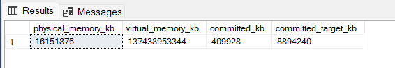

- **physical_memory_kb:** Total physical memory installed on the server.
- **virtual_memory_kb:** Total amount of virtual memory available to SQL Server. Ideally, we do not want to utilize this often as virtual memory (using a page file on disk or somewhere that isn’t memory) is going to be significantly slower than a memory.
- **committed_kb:** The amount of memory currently allocated by the buffer cache for use by database pages.
- **committed_target_kb:** This is the amount of memory the buffer cache “wants” to use. If the amount currently in use (indicated by committed_kb) is higher than this amount, then the buffer manager will begin to remove older pages from memory. If the amount currently in use is lower then the buffer manager will allocate more memory for our data.

# Using Buffer Cache Metrics

We can access information about the buffer cache using the dynamic management view `sys.dm_os_buffer_descriptors`, which provides everything you’ve ever wanted to know about the data stored in memory by SQL Server

A useful metric that is easy to get is a measure of buffer cache usage by database on the server:

```sql
SELECT
    databases.name AS database_name,
    COUNT(*) * 8 / 1024 AS mb_used
FROM sys.dm_os_buffer_descriptors
INNER JOIN sys.databases
ON databases.database_id = dm_os_buffer_descriptors.database_id
GROUP BY databases.name
ORDER BY COUNT(*) DESC;
```

This query returns, in order from most pages in memory to fewest, the amount of memory consumed by each database in the buffer cache:

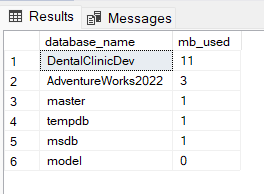

The `DentalClinicDev` is not very exciting right now, but if we execute more queries against the database, we could run our query from above again to verify the impact it had on the buffer cache:

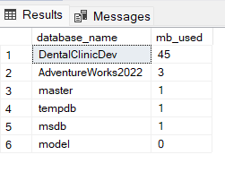

This query can be a useful way to quickly determine which database accounts for the most memory usage in the buffer cache. On a multi-tenant architecture, or a server in which there are many key databases sharing resources, this can be a quick method to find a database that is performing poorly or hogging memory at any given time.

Similarly, we can view overall totals as a page or byte count:

```sql
SELECT
	COUNT(*) AS buffer_cache_pages,
	COUNT(*) * 8 / 1024 AS buffer_cache_used_MB
FROM sys.dm_os_buffer_descriptors;
```

This returns a single row containing the number of pages in the buffer cache, as well as the memory consumed by them:

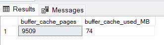

We can subdivide this further and look at how the buffer cache is used by specific objects. This can provide much more insight into memory usage as we can determine **what tables are memory hogs**. In addition, we can verify some interesting metrics, such as **what percentage of a table is in memory currently**, or **what tables are infrequently (or not) used**. The following query will return buffer pages and size by table:

```sql
SELECT
	objects.name AS object_name,
	objects.type_desc AS object_type_description,
	COUNT(*) AS buffer_cache_pages,
	COUNT(*) * 8 / 1024  AS buffer_cache_used_MB
FROM sys.dm_os_buffer_descriptors
INNER JOIN sys.allocation_units
ON allocation_units.allocation_unit_id = dm_os_buffer_descriptors.allocation_unit_id
INNER JOIN sys.partitions
ON ((allocation_units.container_id = partitions.hobt_id AND type IN (1,3))
OR (allocation_units.container_id = partitions.partition_id AND type IN (2)))
INNER JOIN sys.objects
ON partitions.object_id = objects.object_id
WHERE allocation_units.type IN (1,2,3)
AND objects.is_ms_shipped = 0
AND dm_os_buffer_descriptors.database_id = DB_ID()
GROUP BY objects.name,
		 objects.type_desc
ORDER BY COUNT(*) DESC;
```

A segment of the results of this are as follows:

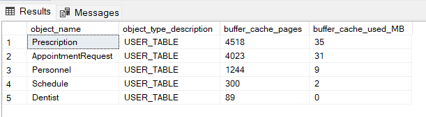

Similarly, we can split out this data by index, instead of by table, providing even further granularity on buffer cache usage:

```sql
SELECT
	indexes.name AS index_name,
	objects.name AS object_name,
	objects.type_desc AS object_type_description,
	COUNT(*) AS buffer_cache_pages,
	COUNT(*) * 8 / 1024  AS buffer_cache_used_MB
FROM sys.dm_os_buffer_descriptors
INNER JOIN sys.allocation_units
ON allocation_units.allocation_unit_id = dm_os_buffer_descriptors.allocation_unit_id
INNER JOIN sys.partitions
ON ((allocation_units.container_id = partitions.hobt_id AND type IN (1,3))
OR (allocation_units.container_id = partitions.partition_id AND type IN (2)))
INNER JOIN sys.objects
ON partitions.object_id = objects.object_id
INNER JOIN sys.indexes
ON objects.object_id = indexes.object_id
AND partitions.index_id = indexes.index_id
WHERE allocation_units.type IN (1,2,3)
AND objects.is_ms_shipped = 0
AND dm_os_buffer_descriptors.database_id = DB_ID()
GROUP BY indexes.name,
		 objects.name,
		 objects.type_desc
ORDER BY COUNT(*) DESC;
```

The results provide even more detail on how the buffer cache is being used, and can be valuable on tables with many indexes of varied use:

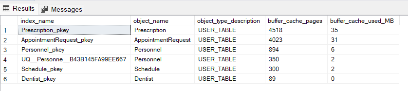

The results can be useful when trying to determine the overall level of usage for a specific index at any given time. In addition, it allows us to gauge how much of an index is being read, compared to its overall size.

To collect the percentage of each table that is in memory, we can put that query into a CTE and compare the pages in memory vs the total for each table:

```sql

WITH CTE_BUFFER_CACHE AS (
	SELECT
		objects.name AS object_name,
		objects.type_desc AS object_type_description,
		objects.object_id,
		COUNT(*) AS buffer_cache_pages,
		COUNT(*) * 8 / 1024  AS buffer_cache_used_MB
	FROM sys.dm_os_buffer_descriptors
	INNER JOIN sys.allocation_units
	ON allocation_units.allocation_unit_id = dm_os_buffer_descriptors.allocation_unit_id
	INNER JOIN sys.partitions
	ON ((allocation_units.container_id = partitions.hobt_id AND type IN (1,3))
	OR (allocation_units.container_id = partitions.partition_id AND type IN (2)))
	INNER JOIN sys.objects
	ON partitions.object_id = objects.object_id
	WHERE allocation_units.type IN (1,2,3)
	AND objects.is_ms_shipped = 0
	AND dm_os_buffer_descriptors.database_id = DB_ID()
	GROUP BY objects.name,
			 objects.type_desc,
			 objects.object_id)
SELECT
	PARTITION_STATS.name,
	CTE_BUFFER_CACHE.object_type_description,
	CTE_BUFFER_CACHE.buffer_cache_pages,
	CTE_BUFFER_CACHE.buffer_cache_used_MB,
	PARTITION_STATS.total_number_of_used_pages,
	PARTITION_STATS.total_number_of_used_pages * 8 / 1024 AS total_mb_used_by_object,
	CAST((CAST(CTE_BUFFER_CACHE.buffer_cache_pages AS DECIMAL) / CAST(PARTITION_STATS.total_number_of_used_pages AS DECIMAL) * 100) AS DECIMAL(5,2)) AS percent_of_pages_in_memory
FROM CTE_BUFFER_CACHE
INNER JOIN (
	SELECT 
		objects.name,
		objects.object_id,
		SUM(used_page_count) AS total_number_of_used_pages
	FROM sys.dm_db_partition_stats
	INNER JOIN sys.objects
	ON objects.object_id = dm_db_partition_stats.object_id
	WHERE objects.is_ms_shipped = 0
	GROUP BY objects.name, objects.object_id) PARTITION_STATS
ON PARTITION_STATS.object_id = CTE_BUFFER_CACHE.object_id
ORDER BY CAST(CTE_BUFFER_CACHE.buffer_cache_pages AS DECIMAL) / CAST(PARTITION_STATS.total_number_of_used_pages AS DECIMAL) DESC;
```

This query joins our previous data set with a query on `sys.dm_db_partition_stats` in order to compare what’s currently in the buffer cache vs the total space used by any given table. The various CAST operations at the end help to avoid truncation and make the final result in a form that is easy to read. The results are as follows:

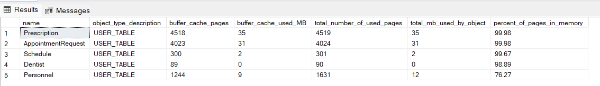

This data can tell us which tables are hot spots in our database, and with some knowledge of their application usage, we can determine which ones simply have too much data residing in memory. By combining our metrics from the buffer cache and plan cache, we can devise new ways of pinpointing bad queries or applications that are pulling far more data than they require.

This query can be modified to provide the percentage of an index that is being used as well, similar to how we collected the percentage of a table used:

```sql

SELECT
	indexes.name AS index_name,
	objects.name AS object_name,
	objects.type_desc AS object_type_description,
	COUNT(*) AS buffer_cache_pages,
	COUNT(*) * 8 / 1024  AS buffer_cache_used_MB,
	SUM(allocation_units.used_pages) AS pages_in_index,
	SUM(allocation_units.used_pages) * 8 /1024 AS total_index_size_MB,
	CAST((CAST(COUNT(*) AS DECIMAL) / CAST(SUM(allocation_units.used_pages) AS DECIMAL) * 100) AS DECIMAL(5,2)) AS percent_of_pages_in_memory
FROM sys.dm_os_buffer_descriptors
INNER JOIN sys.allocation_units
ON allocation_units.allocation_unit_id = dm_os_buffer_descriptors.allocation_unit_id
INNER JOIN sys.partitions
ON ((allocation_units.container_id = partitions.hobt_id AND type IN (1,3))
OR (allocation_units.container_id = partitions.partition_id AND type IN (2)))
INNER JOIN sys.objects
ON partitions.object_id = objects.object_id
INNER JOIN sys.indexes
ON objects.object_id = indexes.object_id
AND partitions.index_id = indexes.index_id
WHERE allocation_units.type IN (1,2,3)
AND objects.is_ms_shipped = 0
AND dm_os_buffer_descriptors.database_id = DB_ID()
GROUP BY indexes.name,
		 objects.name,
		 objects.type_desc
ORDER BY CAST((CAST(COUNT(*) AS DECIMAL) / CAST(SUM(allocation_units.used_pages) AS DECIMAL) * 100) AS DECIMAL(5,2)) DESC;
```

Since sys.allocation_units provides some size info on our indexes, we avoid the need for the additional CTE and data set from `dm_db_partition_stats`. Here is a slice of the results, showing index size (MB and pages) and buffer cache space used (MB and pages):

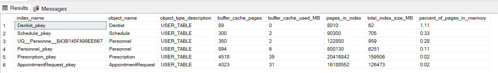

This data provides a nice view into the efficiency of queries on specific indexes and could assist in index cleanup, index tuning, or some more granular tuning of memory usage on your SQL Server.

An interesting column in `dm_os_buffer_descriptors` is the `free_space_in_bytes column`. This tells us how full each page in the buffer cache is, and therefore provides an indicator of potential wasted space or inefficiency. We can determine the percentage of pages that are taken up by free space, rather than data, for each database on our server. This is interesting, however not too useful yet as these results are not very targeted. They tell us a database may have some wasted space, but not much about what tables are the culprit.

Let’s take the same approach we previously did and return free space per table in a given database:

```sql
SELECT
	objects.name AS object_name,
	objects.type_desc AS object_type_description,
	COUNT(*) AS buffer_cache_pages,
	CAST(COUNT(*) * 8 AS DECIMAL) / 1024  AS buffer_cache_total_MB,
	CAST(SUM(CAST(dm_os_buffer_descriptors.free_space_in_bytes AS BIGINT)) AS DECIMAL) / 1024 / 1024 AS buffer_cache_free_space_in_MB,
	CAST((CAST(SUM(CAST(dm_os_buffer_descriptors.free_space_in_bytes AS BIGINT)) AS DECIMAL) / 1024 / 1024) / (CAST(COUNT(*) * 8 AS DECIMAL) / 1024) * 100 AS DECIMAL(5,2)) AS buffer_cache_percent_free_space
FROM sys.dm_os_buffer_descriptors
INNER JOIN sys.allocation_units
ON allocation_units.allocation_unit_id = dm_os_buffer_descriptors.allocation_unit_id
INNER JOIN sys.partitions
ON ((allocation_units.container_id = partitions.hobt_id AND type IN (1,3))
OR (allocation_units.container_id = partitions.partition_id AND type IN (2)))
INNER JOIN sys.objects
ON partitions.object_id = objects.object_id
WHERE allocation_units.type IN (1,2,3)
AND objects.is_ms_shipped = 0
AND dm_os_buffer_descriptors.database_id = DB_ID()
GROUP BY objects.name,
			objects.type_desc,
			objects.object_id
HAVING COUNT(*) > 0
ORDER BY COUNT(*) DESC;
```

This returns a row per table or indexed view that has at least one page in the buffer cache, ordered by those with the most pages in memory first.

What does this mean exactly? The more free space per page on average, the more pages need to be read in order to return the data that we’re looking for. In addition, more pages are required to store data, meaning more space in memory and on disk is required to maintain our data. Wasted space also means more IOs to get the data we need and queries running longer than needed as this data is retrieved.

Within `dm_os_buffer_descriptors` we can verify whether a page is clean or not using the `is_modified` column. This tells us if a page has been modified by a write operation, but has yet to be written back to disk. We can use this information to count the clean vs dirty pages in the buffer cache for a given database:

```sql
SELECT
    databases.name AS database_name,
	COUNT(*) AS buffer_cache_total_pages,
    SUM(CASE WHEN dm_os_buffer_descriptors.is_modified = 1
				THEN 1
				ELSE 0
		END) AS buffer_cache_dirty_pages,
    SUM(CASE WHEN dm_os_buffer_descriptors.is_modified = 1
				THEN 0
				ELSE 1
		END) AS buffer_cache_clean_pages,
    SUM(CASE WHEN dm_os_buffer_descriptors.is_modified = 1
				THEN 1
				ELSE 0
		END) * 8 / 1024 AS buffer_cache_dirty_page_MB,
    SUM(CASE WHEN dm_os_buffer_descriptors.is_modified = 1
				THEN 0
				ELSE 1
		END) * 8 / 1024 AS buffer_cache_clean_page_MB
FROM sys.dm_os_buffer_descriptors
INNER JOIN sys.databases
ON dm_os_buffer_descriptors.database_id = databases.database_id
GROUP BY databases.name;
```

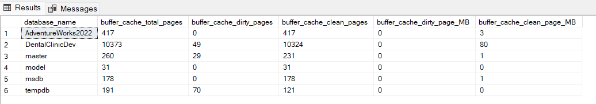

The server doesn’t have too much going on at the moment. If we were to run a big update statement, we could illustrate what we would see when more write operations are going on. Let’s run the following query:

```sql
update AppointmentRequest set note = CONCAT(note, 'abc')
```

If we run the dirty/clean page count from above, we’ll get some more interesting results:

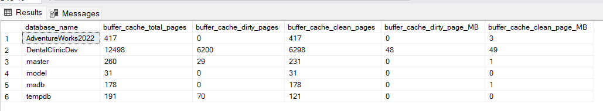

About 1/2  of the pages for *DentalClinicDev* in the buffer cache are dirty.

As with before, we can break this out by table or index in order to collect more granular data on buffer cache usage:

```sql
SELECT
	indexes.name AS index_name,
	objects.name AS object_name,
	objects.type_desc AS object_type_description,
	COUNT(*) AS buffer_cache_total_pages,
    SUM(CASE WHEN dm_os_buffer_descriptors.is_modified = 1
				THEN 1
				ELSE 0
		END) AS buffer_cache_dirty_pages,
    SUM(CASE WHEN dm_os_buffer_descriptors.is_modified = 1
				THEN 0
				ELSE 1
		END) AS buffer_cache_clean_pages,
    SUM(CASE WHEN dm_os_buffer_descriptors.is_modified = 1
				THEN 1
				ELSE 0
		END) * 8 / 1024 AS buffer_cache_dirty_page_MB,
    SUM(CASE WHEN dm_os_buffer_descriptors.is_modified = 1
				THEN 0
				ELSE 1
		END) * 8 / 1024 AS buffer_cache_clean_page_MB
FROM sys.dm_os_buffer_descriptors
INNER JOIN sys.allocation_units
ON allocation_units.allocation_unit_id = dm_os_buffer_descriptors.allocation_unit_id
INNER JOIN sys.partitions
ON ((allocation_units.container_id = partitions.hobt_id AND type IN (1,3))
OR (allocation_units.container_id = partitions.partition_id AND type IN (2)))
INNER JOIN sys.objects
ON partitions.object_id = objects.object_id
INNER JOIN sys.indexes
ON objects.object_id = indexes.object_id
AND partitions.index_id = indexes.index_id
WHERE allocation_units.type IN (1,2,3)
AND objects.is_ms_shipped = 0
AND dm_os_buffer_descriptors.database_id = DB_ID()
GROUP BY indexes.name,
		 objects.name,
		 objects.type_desc
ORDER BY COUNT(*) DESC;
```

The results show buffer cache usage by index, showing how many of the pages in memory are clean or dirty:

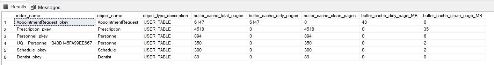

This data provides an idea of the write activity on a given index at this point in time. If it were tracked over a period of days or weeks, we could begin to gauge the overall write activity of the index and trend it. This research could be useful if you were looking to understand the best possible isolation level to use on a database, or if those reports that are always run READ UNCOMMITTED could be more susceptible to dirty reads than originally thought. In this specific case, the dirty pages all relate to the update query that we previously ran above, and therefore comprise a somewhat limited set.

# DBCC DROPCLEANBUFFERS

A DBCC command that is often thrown around as a way to test a query and accurately gauge execution speed is `DBCC DROPCLEANBUFFERS`. When run, this will remove all clean pages from memory for an entire database server, leaving behind only the dirty pages, which will typically be a small minority of data.

`DBCC DROPCLEANBUFFERS` is a command that should typically only be run in a **non-production** environment, and even then, only when there is no performance or load testing being conducted. The result of this command is that the buffer cache will end up mostly empty. Any queries run after this point will need to use physical reads to bring data back into the cache from your storage system, which as we established earlier, is likely much slower than memory.

This can be a useful development tool in that you can run a query in a performance testing environment over and over without any changes in speed/efficiency due to caching of data in memory. Dropping clean buffers will lead to slower execution times than would otherwise be seen, but can provide a way to test queries in a consistent environment with each execution.

# Page Life Expectancy

Page Life Expectancy (PLE) is a measure of, on average, how long (in seconds) will a page remain in memory without being accessed, after which point it is removed.

This is a metric that we want to be higher as we want our important data to remain in the buffer cache for as long as possible. When PLE gets too low, data is being constantly read from disk (aka: slow) into the buffer cache, removed from the cache, and likely read from disk again in the near future. This is the recipe for a slow (and frustrating) SQL Server!

To view the current PLE on a server, you can run the following query, which will pull the current value from the performance counter dynamic management view:

```sql
SELECT
	*
FROM sys.dm_os_performance_counters
WHERE dm_os_performance_counters.object_name LIKE '%Buffer Manager%'
AND dm_os_performance_counters.counter_name = 'Page life expectancy';
```

The results will look like this:

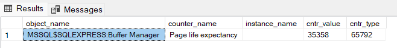

`cntr_value` is the value of the performance counter. Since very little data is read or written on my SQL Server, the need to remove data from the buffer cache is low, and therefore PLE is absurdly high. On a more heavily used production server, PLE would almost certainly be lower.

The most obvious question now is, **“What is a good value for PLE?”**

Before considering what a good PLE is, we need to ask ourselves some questions:

- How much data traffic to we expect on average by our applications/services?
- Are there “special” times when backups, index maintenance, archiving, DBCC CheckDB, or other processes may cause PLE to become very low?
- Is latency an issue? Are there measurable waits that are causing applications to perform poorly?
- Are there significant IO waits on the server?
- Which queries do we expect to read the most data?

# Conclusion

Peeking into the buffer cache is a great way to learn more about how your applications and processes are performing. With this information, you can track down poorly performing queries, identify objects that use more memory than they should, and improve server planning for the future. This knowledge spans development, administration, architecture, and design in terms of who impacts it and who can be influenced by it. As a result, effectively staying on top of your server’s memory management will make your life easier, while improving the experience for anyone that uses your SQL Servers.

# Reference

- https://www.sqlshack.com/insight-into-the-sql-server-buffer-cache/