## Indexing 

### Appointment Request Table: 

**Create a non clustered index on `appointmentTime` and `requestTime`**

- *Appointment Request Table* is a large table with a lot of data and is added on a daily basis, staffs also need to query frequently to schedule appointments for patients.
- Staffs will usually rely on the `appointmentTime` of an appointment request to create a schedule, that is why it is necessary to index on `appointmentTime`.
- According to the business, every day, staffs will usually check the appointment requests made on the same day (`requestTime` = TODAY), so indexing on `requestTime` is necessary when the query frequency occurs daily.

### Session Table:

**Create non clustered index on `time`, `patientID`, `dentistID`**

- *Session Table* is a large table (around 200000 rows) and is the most important table in the database. It is also the table that is queried the most frequently.
- Fields such as `time`, `patientID`, `dentistID` are fields that are rarely updated once created. Because of this, we can indexing on these fields to reduce the query time:
  - Indexing on `time` to reduce the query time of sessions, which include treatment sessions, examinations, re-examinations. According to the business, the query frequency of these sessions is very high and also occurs daily.
  - Indexing on `patientID`, `dentistID` to reduce the query time when joining the `Session` table with the `Patient` or `Personnel` table, as well as querying the `Session` table by `patientID`, `dentistID`, some of which include searching for the sessions of a patient, the sessions of a dentist, etc.

### Payment Record Table:

**Create a non clustered index on `patientID`**

- *Payment Record Table* is a table with a 1-1 relationship with the *Treatment Session Table*, whose data is also very large.
- Indexing on the foreign key `patientID` will speed up the query when we want to get information related to the patient of a payment record, get the payment records of a patient, etc.

### Prescription Table:

**Clustered index on `treatmentSessionID`, `drugID`**

- `treatmentSessionID` together with `drugID` form a composite primary key, so they already have a clustered index. However, sorting `treatmentSessionID` first plays an important role in speeding up the query when most of the conditions in the query use `treatmentSessionID` to compare or to search.

### ToothSession Table:

**Clustered index on `treatmentSessionID`, `toothID`**

Similar to the *Prescription Table*, `treatmentSessionID`, `toothID` have already been indexed as a composite primary key, but sorting `treatmentSessionID` first plays an important role when most of the conditions in the query use `treatmentSessionID` to compare or to search.

### Evaluation

#### Evaluation 1

Consider the following query: to find appointments that are requested on the same day. This query will be used on the `AppointmentRequest` table:

```sql
select * from dbo.[AppointmentRequest]
where appointmentTime >= '2023-08-26 00:00:00'
and appointmentTime < '2023-08-27 00:00:00'
-- The time is hard-coded for testing purpose
```

Without index, the execution plan is as follows:

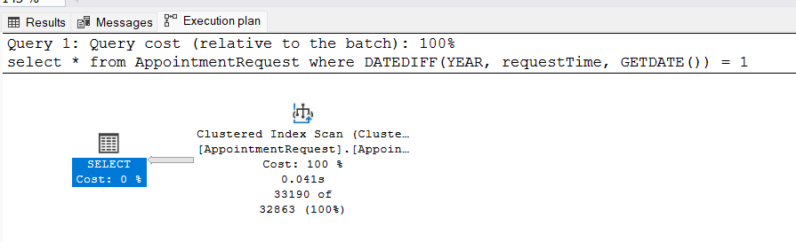

We can see that the query optimizer has to scan the clustered index of the table, which is very time-consuming. The query optimizer also suggests us to create an index (by stating "Missing Index").
The client statistics is as follows:

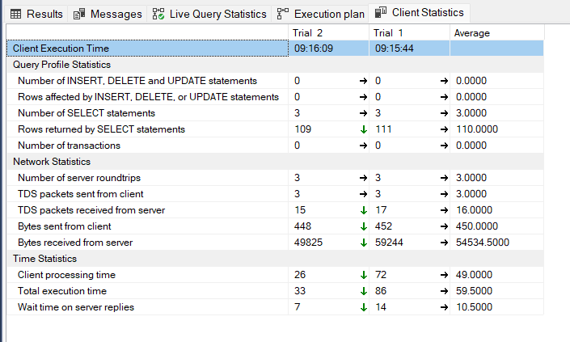

With index, the execution plan is as follows:

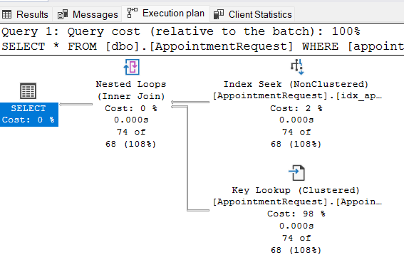

As you can see, the query optimizer now utilizes sthe `Index Seek` operator, which is much faster than the `Clustered Index Scan` operator.
The client statistics is as follows:

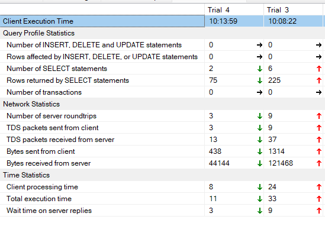

Trial 4 is the query with index, and Trial 3 is the query without index. We can see that the query with index is much faster than the query without index and the average processing time is almost 3 times faster. The bytes sent from client and bytes received from server are also much smaller. Overall, everything has improved, denoted with the green arrows

We also noticed that the query optimizer would not utilize the index if there is a function applied to the field. For example, the following query will not utilize the index although it is the same query as the previous one:

```sql
select * from dbo.[AppointmentRequest]
where DATEDIFF(day, appointmentTime, '2023-08-26') = 0
```

The execution plan now uses `Index Scan` instead of `Index Seek` (we have indexed on `appointmentTime`), which is slower than `Index Seek`:

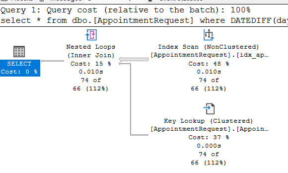

Comparing that with the previous query:

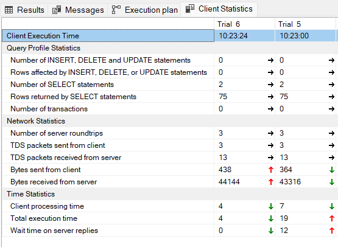

Trial 5 is the old query, and Trial 6 is the new query. We can see that the query with function applied to the field is slower than the query without function applied to the field.

Therefore, we need to make sure that the query does not have any function applied to the `appointmentTime` field, and have come with workarounds to solve this problem. This also applies to other fields with `datetime` data type.

The index on `requestTime` is similar to the index on `appointmentTime`, so we will not go into details.

#### Evaluation 2

Consider the following query: to find sessions that belong to a patient. This query will be used on the `Session` table:

```sql
select * from dbo.[Session]
where patientID = 1
-- The patientID is hard-coded for testing purpose
```

Without index, the execution plan is as follows:

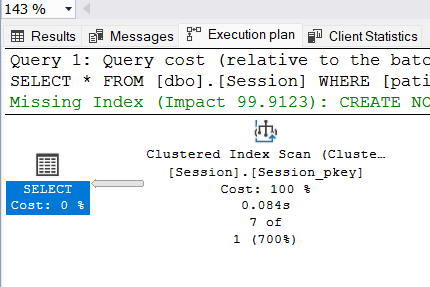

We can see that the query optimizer has to scan the clustered index of the table. The query optimizer also suggests us to create an index (by stating "Missing Index").

The client statistics is as follows:

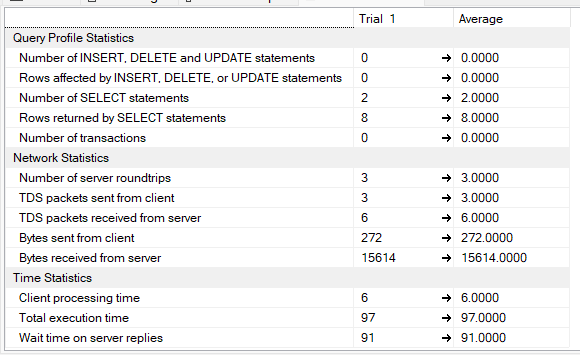

With index, the execution plan is as follows:

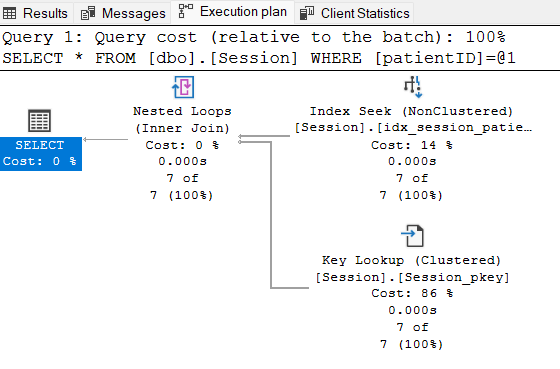

As you can see, the query optimizer now utilizes the `Index Seek` operator, which is much faster than the `Clustered Index Scan` operator.

The client statistics is as follows:

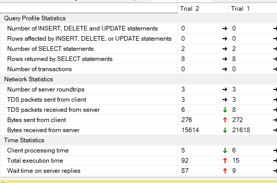

Trial 1 is the query with index, and Trial 2 is the query without index. We can see that the total execution time of the query with index is much faster than the query without index.

The same can be applied to queries with foreign keys.

#### Evaluation 3

Consider the following query: to find prescription belonging to a treatment session. This query will be used on the `Prescription` table:

```sql
select * from dbo.[Prescription]
where treatmentSessionID = 500
-- The treatmentSessionID is hard-coded for testing purpose
```

When the index is created on the reverse order to what we have suggested, which is to put `drugID` first and `treatmentSessionID` second, the execution plan is as follows:

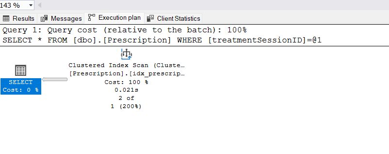

Although we have index on the table, the query optimizer still has to scan the clustered index of the table instead of utilizing the Index Seek operator.

By placing `treatmentSessionID` first, the query optimizer can utilize the Index Seek operator:


This is because the query optimizer will utilize the index if the query has the same order as the index. Therefore, we need to make sure that the query has the same order as the index. This applies to other tables with composite primary keys as well.