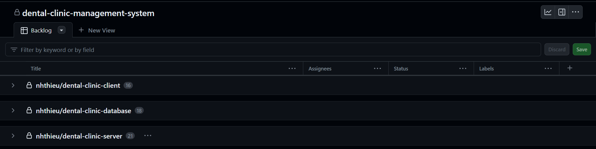
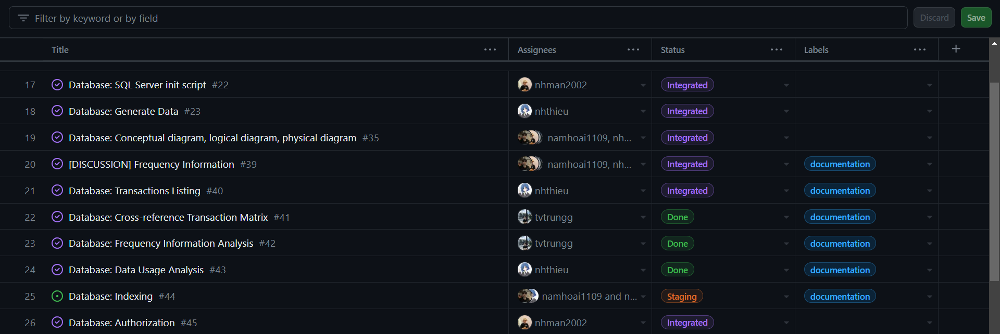
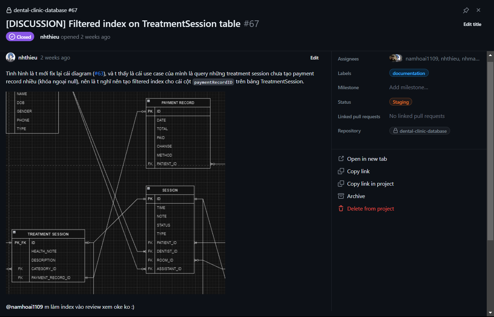

# Tool

We use Github Projects to manage our tasks as well as our repositories. We divide the whole project into 3 repositories:

- Frontend: The UI of the project, built as a web application.
- Backend: The server of the project, built as a REST API server.
- Database: The main database, built with SQL Server. This repository also contains the database schema and all related documents.

# Tasks Management

We assign each member to a repository based on their skills and preferences. However, everyone is encouraged to contribute to all repositories. For the Database repository, we assign everyone to it since it is the most important repository and is used for grading purposes. In more details:

- Frontend: Nam Hoai, Trung Thieu Vinh
- Server: Hieu Nguyen, Man Nguyen Huynh
- Database: Everyone

Hieu Nguyen is the project manager and is responsible for managing the tasks of the whole project, also for reviewing pull requests and merging them into the main branch. In addition, Nam Hoai is also responsible for managing the tasks of the Frontend repository.

## Tasks

We have a view called `backlog` as the main board for the project. This board is then divided into 3 repositories mentioned above, each will hold all their issues (tasks) accordingly. The `backlog` board is used to track the progress of the project as a whole.

Each issue can be a bug, documentation, a feature or a discussion, and can be linked to a pull request or another issues for the ease of tracking. Each issue is assigned to a member (or many members) and has a label to indicate its type. We also use the `status` label to indicate the status of the issue. The `status` label is used to track the progress of the issue.

The below image is an example of a discussion issue. It is assigned to all the members of our team and is used to discuss the design of the database schema. The issue is linked to another issue (#63) since they are related to each other. Members can leave comments on the issue to discuss the topic.

In addition, we also conducted several team meetings to discuss the progress of the project and cafe sessions to work together.

The link to the project: [Github](https://github.com/nhthieu/dental-clinic-database)
